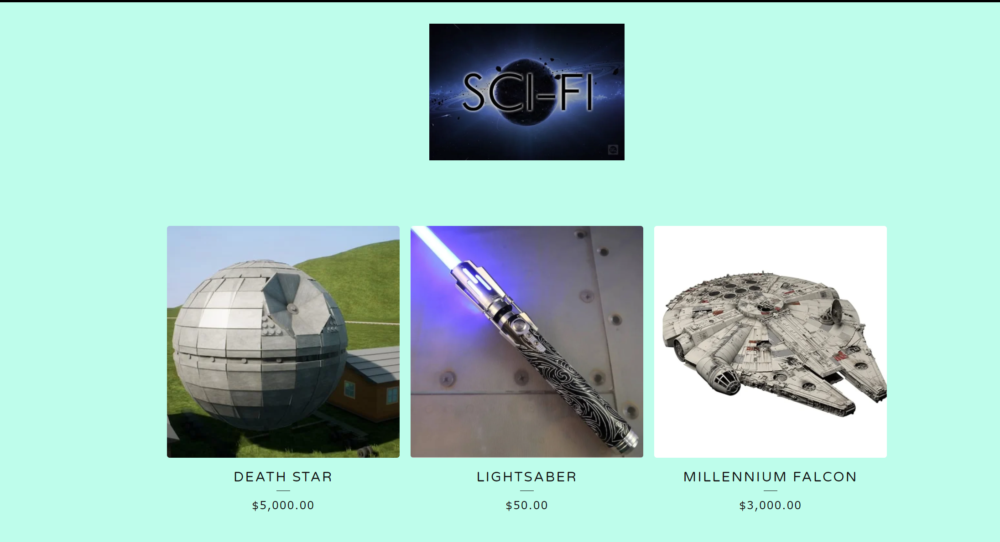

# Sci-Fi



Sci-Fi is an ecommerce application which sells science-fiction themed items. 

## Users can:
* View all items.
  ```GET /items```
* Search for an item by id.
  ```GET /items/byId/{item_id}```
* Search for an item by name.
  ```GET /items/byName/{name}```
* Search for an item by category.
  ```GET /items/byCategory/{category}```
* Add an item to their cart.
  ```POST /orders/{customer_id}```
* See all items in their cart.
  ```GET /orders/{customer_id}```
* Modify an order in their cart.
  ```PUT /orders/update/{customer_id}```
* Remove an order from their cart.
  ```DELETE /orders/{order_id}```
* Set up an account.
  ```POST /customers```
* View their account balance.
  ```GET /customers/{id}```
* Deposit to their account.
  ```PUT /customers/deposit/{customer}```
* Withdraw from their account.
  ```PUT /customers/withdraw/{customer}```

## Item Categories
* Art
* Films
* Books
* Games
* Figurines
* Spaceships!

## Technology Stack 
* GitHub Monorepo
* Agile SDLC:
  * Scrumboard (GitHub Projects)
  * User stories (GitHub Issues/Readme)
* Karate tests
* Reactive Microservices:
  * Spring WebFlux
  * Spring Data Reactive Cassandra
  * Spring WebClient

## How to run
```mvn spring-boot:run```

## Team Members 
* Ted Balashov
* Sezin Demi
* LanChi Pham
* Taryn Jones
* Lane Dorscher
